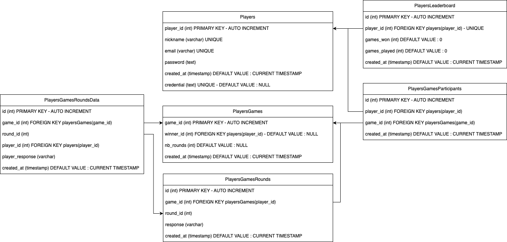
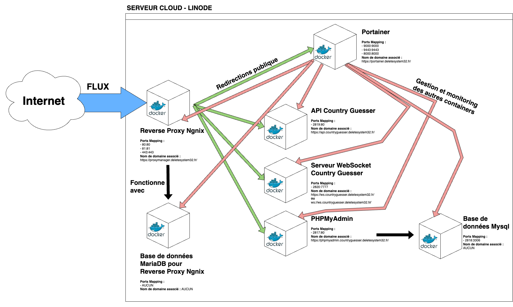
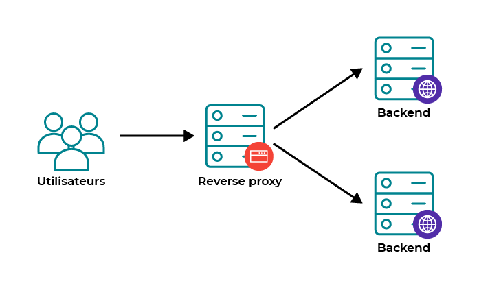

# CountryGuesser

🇫🇷 CountryGuesser est un jeu dans lequel vous devez retrouver le pays sur le globe en fonction d'un drapeau affiché aléatoirement. Vous disposez de 3 indices utilisables. Le jeu se joue tout seul ou à plusieurs.

🇬🇧 CountryGuesser is a game in which you have to find the country on the globe according to a randomly displayed flag. You have 3 usable clues. The game can be played alone or with others.


## Stack

Frontend :

- React TypeScript
- Mapbox
- Material UI<br/>

Backend :

- PHP
- Workerman for WebSocket


## APIs

  

- [RESTCountries](https://restcountries.com/) : Get country data
- [Mapbox GeoCode API](https://developers.google.com/maps/documentation/geocoding/overview) : Get country according to given coordinates

  

## Architecture

### Database Structure


### Backend Infrastructure


### Reverse Proxy Schema


  

## Déploiement (Docker / Production)

Ce repo est prêt pour une exécution **en production** avec:
- **Frontend immuable**: build React au `docker build` (multi-stage) puis servi par **Nginx**
- **Reverse-proxy interne**: le navigateur appelle **`/api/*`** et **`/ws`** (Nginx proxy vers les containers `api` et `websocket`)
- **Ports exposés**: par défaut, seul le frontend est publié sur l’hôte (`3000 -> 80`)

### Lancer en local

```bash
cp .env.example .env
docker compose up -d --build
```

Ensuite ouvre `http://localhost:3000`.

### Publier les images sur un registry (Docker Hub / GHCR)

1) Mets un préfixe et un tag dans `.env`:
- `IMAGE_PREFIX=ghcr.io/<user_or_org>/countryguesser` (ou `docker.io/<user>`)
- `IMAGE_TAG=1.0.0`

2) Login au registry:

```bash
docker login ghcr.io
```

3) Build + push:

```bash
docker compose build
docker compose push
```

### Déployer sur un serveur

Sur le serveur (avec le même `docker-compose.yml` + un `.env` qui pointe vers les images):

```bash
docker login ghcr.io
docker compose pull
docker compose up -d
```

## Collaborators

* Jordan BAUMARD
* Pierre LEOCADIE
* Charles HURST
